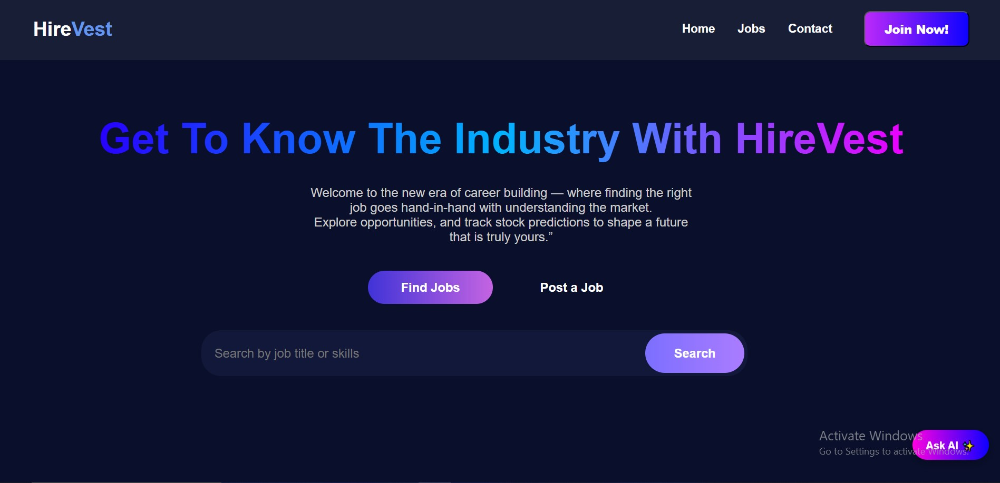
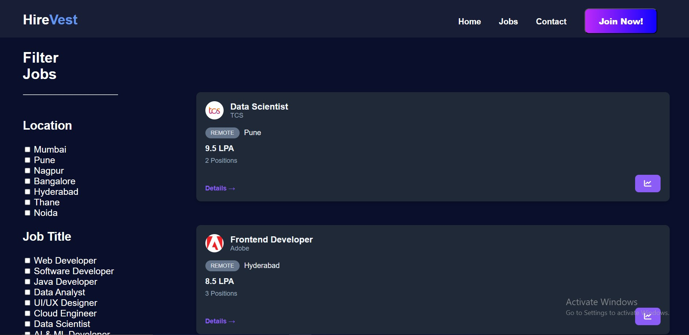
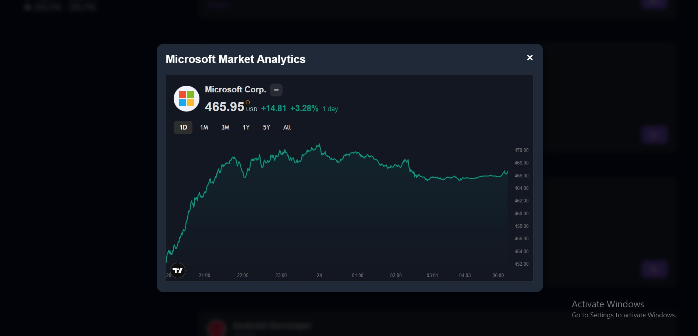

# 🚀 HireVest: Career Meets Capital
HireVest is a premium, high-performance job portal designed for the modern job-seeker who thinks like an investor. We don't just show you where to work; we show you who you're working for by integrating real-time stock market data directly into job cards.

- Why HireVest? Because a company's financial health is just as important as the job description.

## ✨ Key Features
- Premium Glassmorphic UI: A dark-themed, modern interface built for readability and "wow" factor.

- Live Stock Integration: View real-time market performance (BSE/NSE/NASDAQ) of hiring companies to assess their long-term stability.

- Smart Job Filtering: Filter by location, job title, and package range with instant DOM updates.

- Dynamic Card Generation: Supports both hardcoded listings and dynamically added jobs via localStorage.

- Financial History Analytics: One-click access to interactive charts to see a company’s 5-year growth or recent volatility.

---

## 📸 Visual Journey
- 🖥️ Main Dashboard
    

- 📝 Job Listing
    

- 📊 Financial Insights in Action
    

---

## 🗺️ The Roadmap (Upcoming Features)

1. Anonymous Employee Review SystemA safe space for current employees to share the "real" office culture.

2. AI Culture IndicatorAn analytical engine that parses review sentiment to provide a simple visual rating.

- The Concept: Our algorithm will scan reviews for keywords related to "Work-life balance," "Management," and "Growth," then output a "Culture Health Score" next to the stock price.

---

## 🚀 Getting Started

- Clone the repository:

    ```
    git clone https://github.com/yourusername/HireVest_.git
    ```
- Open the project: 

    ```
    cd jobvista
    ```
- Run:
    ```
    node server.js
    ```

## 🤝 Contribution & Feedback
HireVest is a student-led project. If you have ideas on how to improve the stock mapping or the sentiment analysis logic, feel free to fork this repo and submit a PR!

---

## 👨‍💻 Developed by
- Yashraj Kore - Passionate Web/Java Developer & Financial Enthusiast
- Tejas Jadhav - Passionate Python Developer
- Karan More - Passionate Web Developer
- Aditya Patil - Passionate Developer